# Bitcoin systematic trading research

An hourly-BTC machine-learning study, followed by an audit and a reproducible causal reference implementation. The aim is to test whether technical features carry useful directional information and whether that information survives trading costs.

**Main finding:** the original notebook's apparent methodological sophistication did not establish a trading edge. The revised baselines also show weak and unstable predictive performance. Positive returns in one market period are not evidence of alpha.

## Original study and authorship

Original coursework: **Paul Trassaert, Raphael Lebel, Thomas Lesage and Alexandre d’Hérissart**, IMT Atlantique, 2026.  Course context: [Machine Learning and Finance](https://hm-ai.github.io/IMT_ML_and_Finance/).

The original work explored 46 features, a three-state Gaussian HMM, trend-scanning labels, XGBoost/Optuna, Random Forest meta-labelling and expanding-window prediction. Its archived 2021 result was **−68.2% before costs**, versus **+48.4%** for its own benchmark interval. This repository does not relabel that result as profitable.

The `archive/` notebook preserves student code with outputs and external setup/template material removed. It is explicitly superseded: undefined meta-labelling variables and other issues prevent a reliable fresh-kernel execution. The corrected reference uses `research.py` and `run.py`. It is a methodological rewrite, **not an exact reproduction or isolated ablation of the original XGBoost strategy**. The audit and implementation were prepared with AI assistance and should be understood and reviewed by the authors before interview use.

## Original figures and analysis

Read [the complete original analysis](docs/original-analysis.md) for the development choices, interpretations and conclusions, with all saved charts in notebook order. The captions below refer to the original experiment; current methodological qualifications are recorded in [AUDIT.md](AUDIT.md).

### Features, regimes and target construction

The original design combines technical indicators, volatility, serial dependence and a three-state Gaussian HMM. Trend scanning chooses a forward horizon by maximising a regression t-statistic. These plots document the experiment; the original HMM/label handling had temporal limitations identified in the audit.

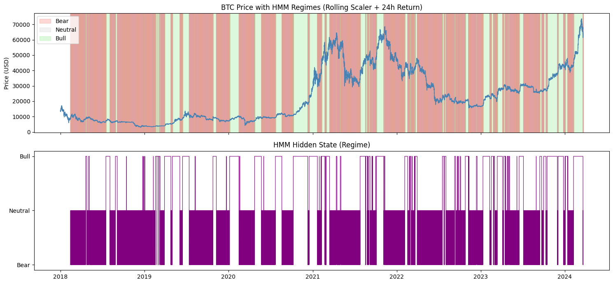

*HMM regimes over time — original saved notebook output.*

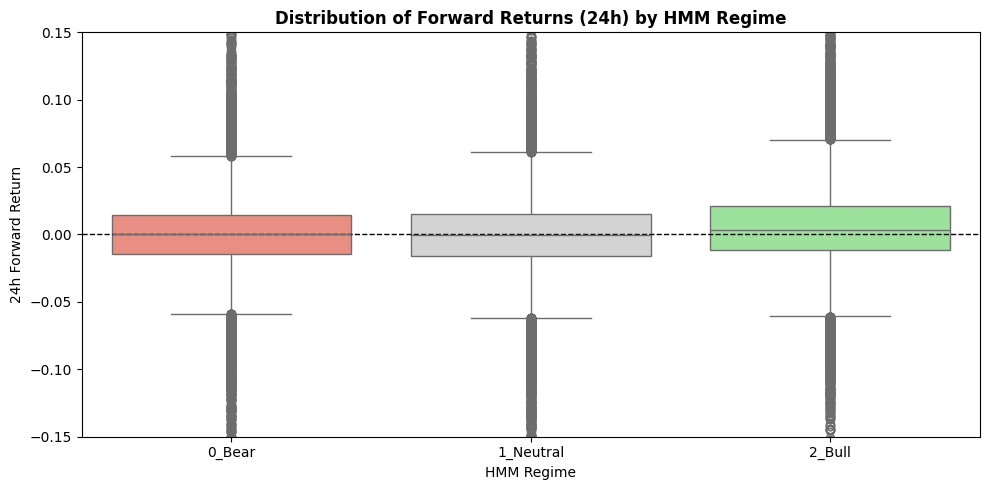

*Forward returns by HMM regime — original saved notebook output.*

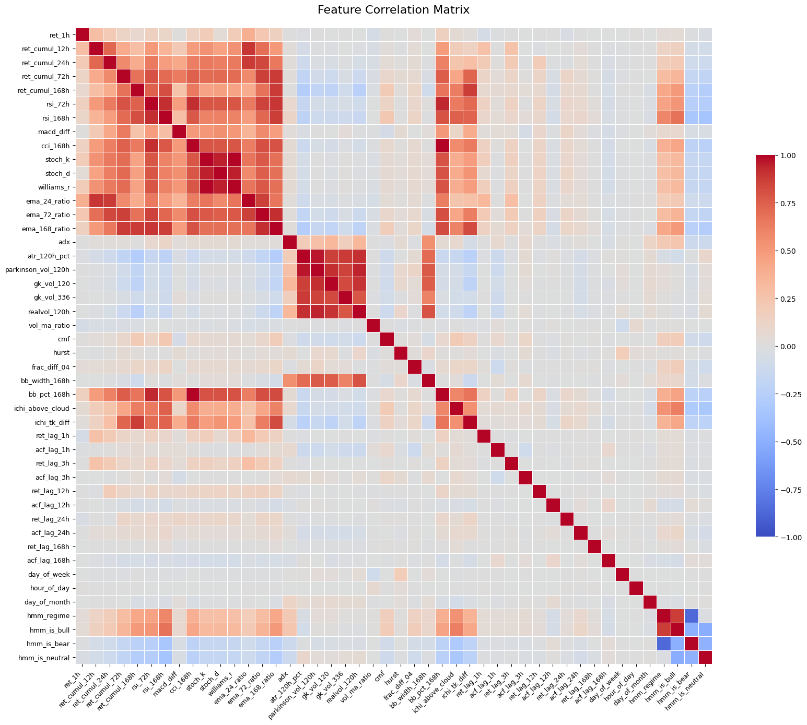

*Feature correlations — original saved notebook output.*

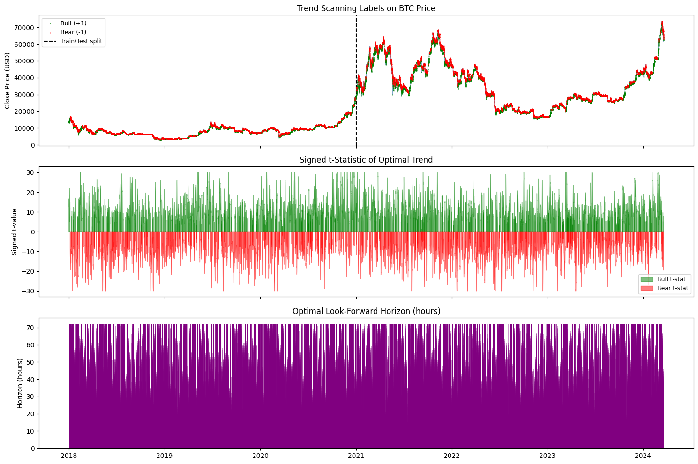

*Trend-scanning labels and selected horizons — original saved notebook output.*

### Feature importance and interpretation

The study compares gain, correlation clustering, permutation importance and SHAP to investigate redundant features and directional bias. These are descriptive diagnostics from the original fitted models.

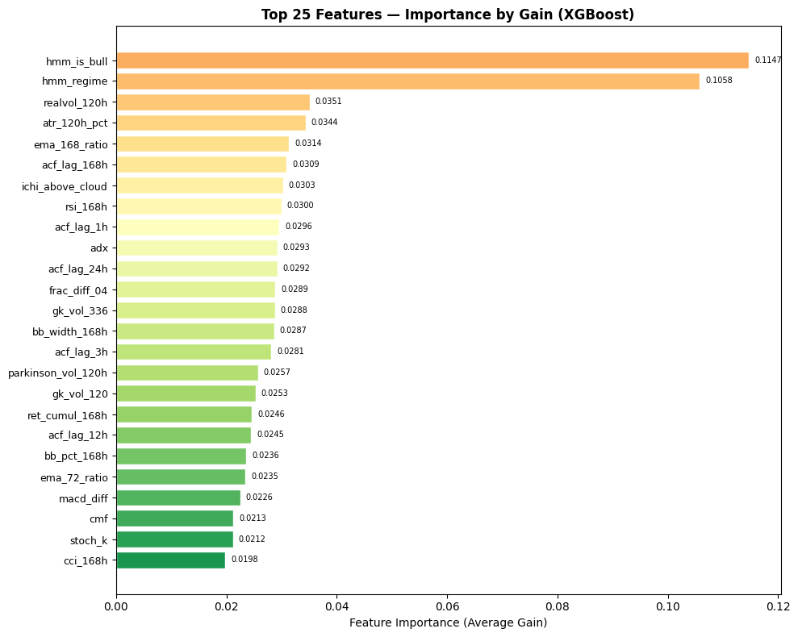

*Feature importance by gain — original saved notebook output.*

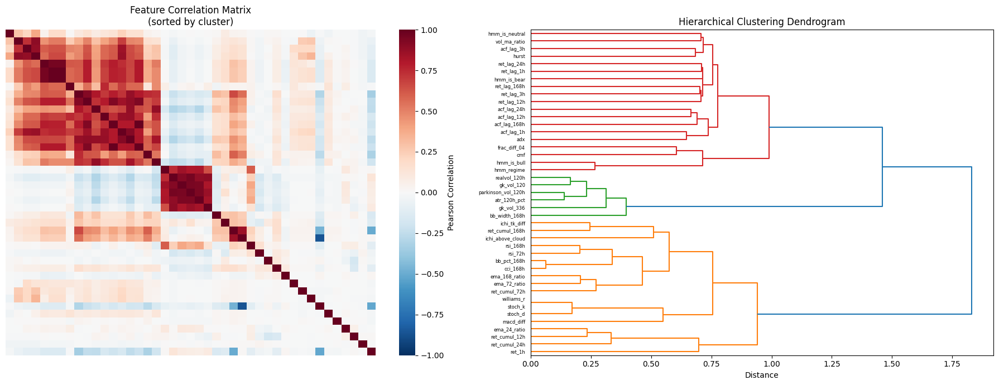

*Correlation clusters and dendrogram — original saved notebook output.*

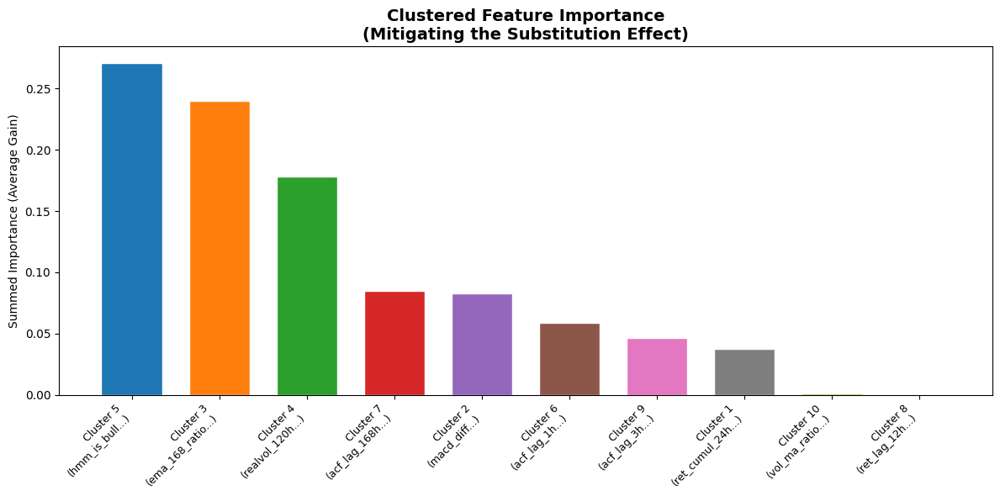

*Clustered feature importance — original saved notebook output.*

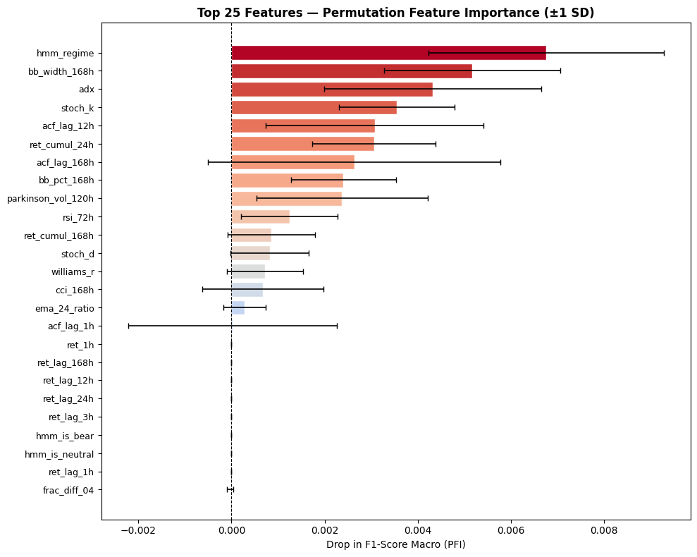

*Permutation feature importance — original saved notebook output.*

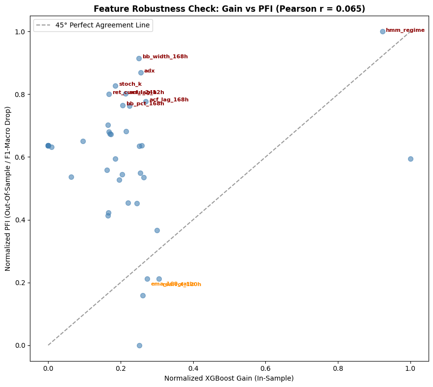

*Gain versus permutation importance — original saved notebook output.*

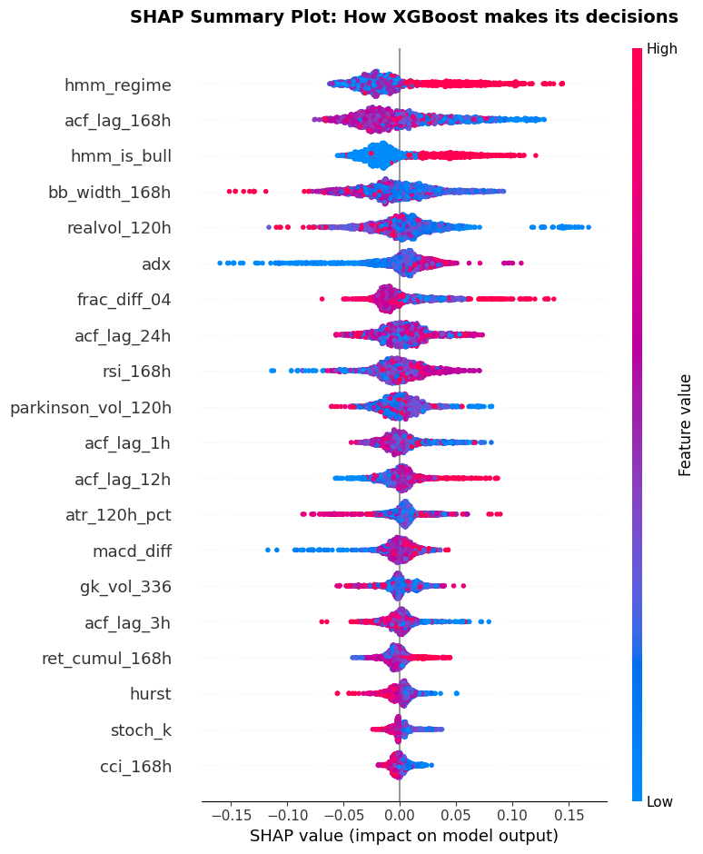

*SHAP summary — original saved notebook output.*

### Prediction quality and original backtest

Confusion matrices, ROC/PR curves, signal plots and backtests expose weak generalisation. The original reported strategy lost 68.2% before costs. Those results use a different protocol and interval from the reference evaluations below.

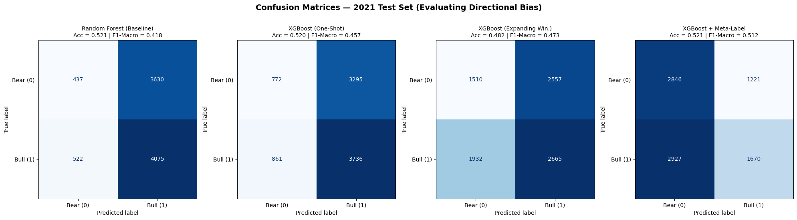

*Confusion matrices — original saved notebook output.*

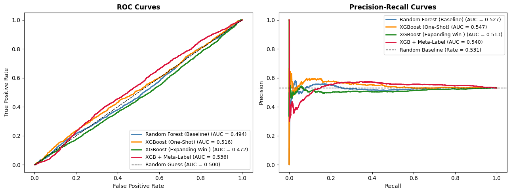

*ROC and precision-recall curves — original saved notebook output.*

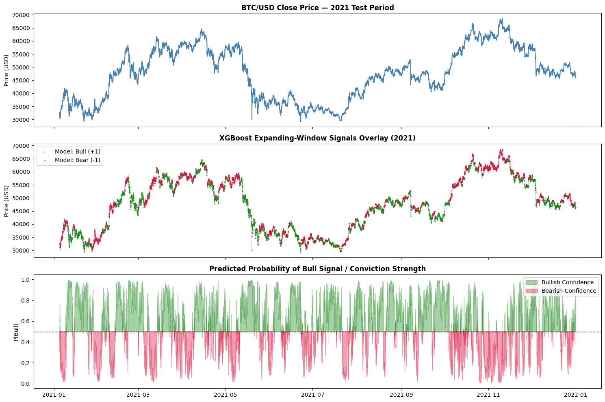

*Directional signals and prediction probabilities — original saved notebook output.*

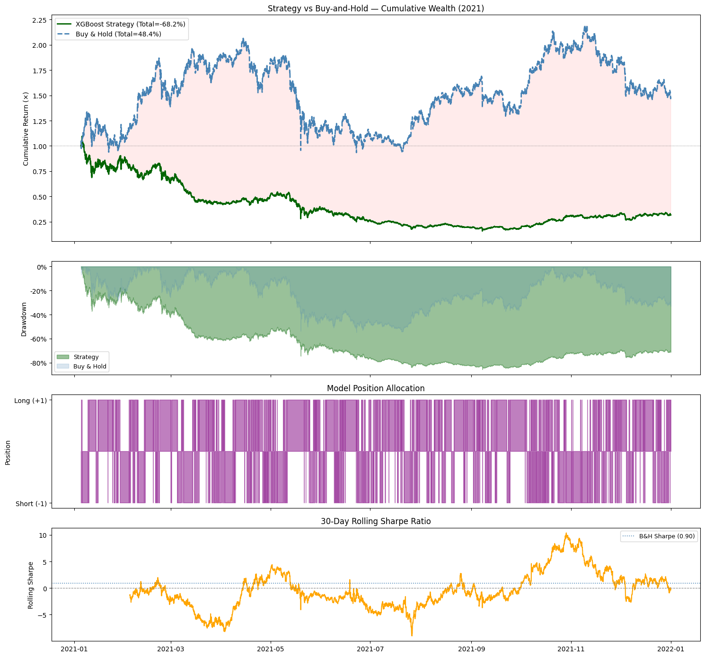

*Original equity, drawdown, signals and rolling Sharpe — original saved notebook output.*

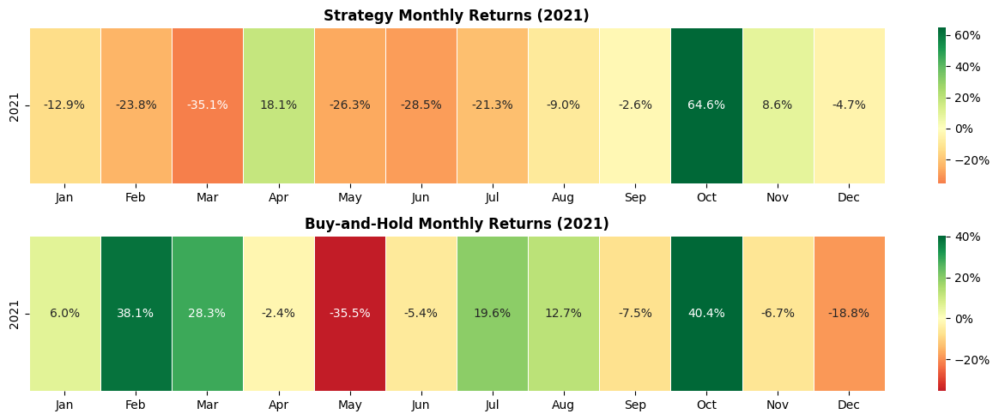

*Original monthly returns: strategy and buy-and-hold — original saved notebook output.*

## Reproduce the reference experiment

Use Python 3.11+ from the repository root:

```bash
python -m venv .venv
source .venv/bin/activate
python -m pip install -r requirements.txt
python -m unittest -v
python run.py --csv data/btc_hourly.csv --out results/my_2021_run
```

The original notebook obtains its CSV from this [course-provided download](https://drive.google.com/uc?id=1P_5ykYLd5521QUdCxC_cMytdJ3PqESTw). Download it into `data/btc_hourly.csv` if you have access. Raw data is not redistributed here; its venue, construction and redistribution licence have not been independently established.

Expected schema: first column `date`, then `coin,open,high,low,close,volume`. The inspected file contains **54,496 continuous hourly BTC bars**, from **2018-01-01 01:00** through **2024-03-20 16:00**, without duplicate timestamps or missing values. SHA-256, package versions and date ranges are recorded for each run. OHLC ordering and positive prices are checked. The supplied timestamps have no timezone; the code preserves this convention and **assumes bar-start timestamps**. Confirm the source's timestamp convention before any execution use.

For the additional retrospective checks:

```bash
python run.py --csv data/btc_hourly.csv --start 2022-01-01 --end '2022-12-31 23:00:00' --out results/my_2022_run
python run.py --csv data/btc_hourly.csv --start 2023-01-01 --end '2023-12-31 23:00:00' --out results/my_2023_run
```

## Temporal and execution protocol

1. Features for bar `t` become available at `t + 1h`. No backfill, smoothed HMM states or fitted full-sample transform is used.
2. Execute at the open of `t + 2h`, one full bar after signal availability. The target is the return from that open to the open 24 hours later.
3. Refit monthly on an expanding history, using only labels whose **availability time is strictly earlier than the fit time**. Training audits record this boundary for every fit. A scaler is fitted inside the logistic pipeline on the eligible history only.
4. Use non-overlapping 24-hour holding periods. Hold long above probability 0.55, short below 0.45, otherwise cash. Parameters and thresholds were fixed before these reruns; no search on the reported years was performed.
5. Hold a fixed quantity within each trade and mark the account hourly. Close and reopen in full at each holding boundary, with no netting. Baseline costs are **5 bps fees + 2 bps slippage per entry/exit leg**; 0 and 15 bps sensitivities are also reported. These are illustrative cost scenarios, not broker quotes.
6. A passive buy-and-hold comparator pays entry/exit costs once over the same time interval. Cash earns zero interest. A simple past-24-hour momentum comparator uses the same holding and cost conventions as the active models.

The account is a hypothetical cash-collateralised long/short research model. Borrow/funding costs, margin/liquidation rules, bid/ask data, liquidity and market impact are not modelled. Entry notional equals initial account equity for that trade; leverage can drift while the fixed quantity is held. Results are not executable derivatives returns. Sharpe annualisation uses hourly returns and does not correct serial dependence.

## Results

See `results/RESULTS.md` for all years, models, cost sensitivity and drawdowns. The classifier evaluates 364 scheduled decisions per year; only a subset produce trades. All periods are **retrospective research**: 2021 was already used during the original development, and the entire price history had appeared in the original analysis. None is presented as a pristine prospective holdout.

The baseline drops the HMM, Hurst proxy, fractional-difference level and meta-model until they can justify incremental value. `forward_filter` provides a tested causal HMM state recursion for future controlled work; it is not used to generate the reported baseline results.

## Reference backtests: 2021, 2022 and 2023

These are the later causal reference runs, with separate models and accounting from the original study. Each year starts at equity 1; costs are 7 bps per entry/exit leg. Full tables and cost sensitivity are in [results/RESULTS.md](results/RESULTS.md).

### 2021

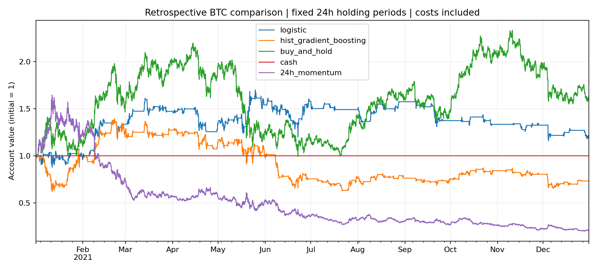

### 2022

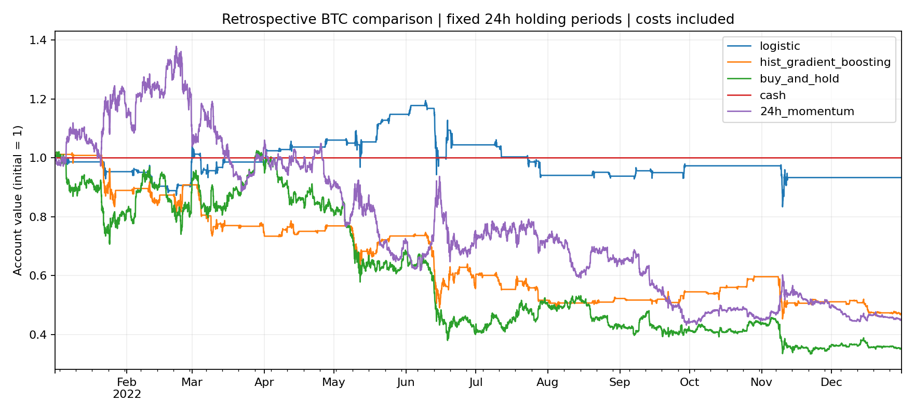

### 2023

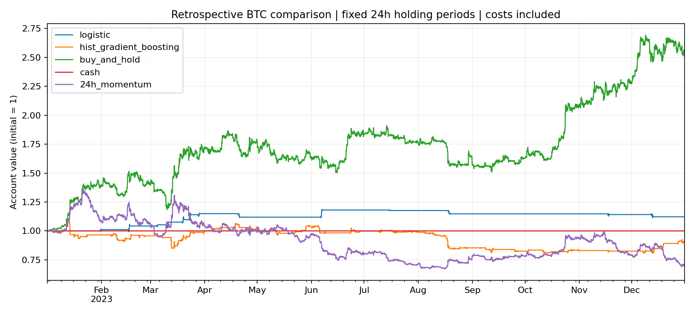

## Files

- `research.py`: features, targets, label-availability filtering, models and accounting.
- `run.py`: reproducible runs, baselines, cost sensitivity, audit CSVs and plots.
- `test_research.py`: tests of future-data invariance, label maturity, execution alignment and cost accounting.
- `notebooks/reference_experiment.ipynb`: a small executable front end.
- `AUDIT.md`: original-code findings and remaining limitations.
- `archive/original_student_research.ipynb`: superseded student code, not the reference execution path.

No open-source licence is asserted over the group's original work; contributor agreement is needed before adding one.
